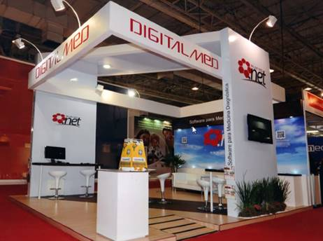

<head>
  <title>Polkadot Treasury Proposal</title>
  <meta charSet="utf-8" />
  <meta property="og:image" content="https://docs.hashed.network/img/networked-desk-cartoon.png" />
  <meta property="twitter:description" content="x DOT for high fidelity videography and interviews from an non-crypto industry event Miami. The Crown Sponsor of the event is built is built on Polkadot and will include Polkadot signage in the sub-headline. Check the sample clips " />
  <meta property="og:description" content="x DOT for high fidelity videography and interviews from an non-crypto industry event Miami. The Crown Sponsor of the event is built is built on Polkadot and will include Polkadot signage in the sub-headline. Check the sample clips " />
  <meta property="og:title" content="Polkadot Treasury Proposal" />
  <meta property="og:url" content="https://docs.hashed.network/blog/investors-event-miami" />
</head>

We are the Crown Sponsor of the [2023 EB-5 & Global Immigration Expo](https://www.eb5investors.com/conferences/eb5-immigration-expo-miami-united-states). The long standing event attracts hundreds of professionals from the bullseye of our targeted user. Some of them are already users. 

The platform's name is "EB5 Proxy" and the subline is "powered by Hashed Network, a Polkadot parachain". Polkadot's logo will show in the booth signage and edited videos. 

We seek funding to record footage from the event, including the talks and fireside chats, where I explain much about our platform, and a bit about how it uses Hashed Network and Polkadot. 

The audience is not a typical crypto conference audience. There will be attorneys, accountants, fund administrators, and broker dealers. This audience provides a strong halo effect to the Polkadot brand because the audience is seeing the brand in their own habitat. 

We will produce and record "man on the street" style interviews throughout the event. 

The high fidelity editing will produce 3 polished videos, each with customized content that puts an emphasis on a particular layer. One for Polkadot, one for Hashed Network, and one for the dapp, EB5 Proxy. The raw footage will be shared publicly for others to use.

Here is the videographer: https://www.johnnypuetz.com/

Check out his showreel or some of these sample videos of similar events: 
- [Art Basel in Miami for Audible](https://vimeo.com/781822259/c4d84b213a) (including "man on the street" style audio setup)
- [John Legend VIP Event at Jazz at Lincoln Center](https://vimeo.com/781821264/97bc60ede1)
- [Handbuilt Show in Texas for BMW](https://www.johnnypuetz.com/post/bmw-motorrad-at-the-handbuilt-show)

The booth will look like this one. (It is just a coincidence that logo looks like the Polkadot logo)

Budget: 
- Videography and Editing/Post-production: $25,000
- Travel and Production team: (awaiting final number) likely around $20,000

