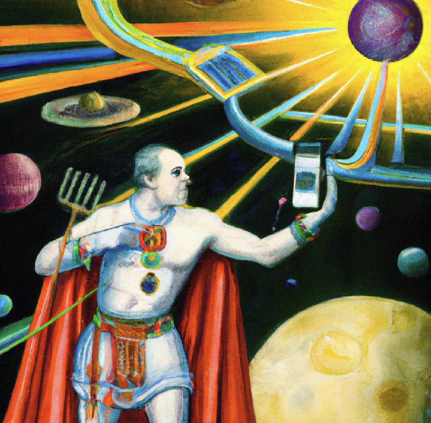

<head>
  <title>Polkadot Signer Usability</title>
  <meta charSet="utf-8" />
  <meta property="og:image" content="https://docs.hashed.network/img/cover-signer.png" />
  <meta property="og:description" content="Onboarding onto Polkadot is hard and there are several areas of friction that users run into. This article identifies three of them and explains the solution that Hashed Network uses to address them." />
  <meta property="og:title" content="Polkadot Signer Usability" />
  <meta property="og:url" content="https://docs.hashed.network/blog/signer" />
</head>

Onboarding onto Polkadot is hard and there are several areas of friction that users run into. This article identifies three of them and explains the solution that Hashed Network uses to address them.

We did not develop the core protocols, but we have built many dapps with them on other blockchains with technical and user success.  I seek feedback on the technical architecture to ensure there are no foundational flaws, any reasons why it won't work with Polkadot, or advice and support on implementation. 

### The Native Token Problem
#### Problem
Like Ethereum, you need the L1 token to do anything on Polkadot. However, in general, users don't begin their journey with the idea of having DOT and trying to find something to do with it. They start with a problem or application (dapp) and have a desire to use it, and then realize there is another step of having to buy DOT, which creates another separate thread of painful friction. 

#### Solution
The Network's solution is to create Sybil-attack resistant methods for a faucet, such as verify SMS. SMS verification allows for a free initial faucet amount. It privately keeps a list of number hashes to avoid mis-use and also shields against VoIP SMS. Other methods could be verifying through a social network site such as Twitter or Github, which typically have their own Sybil protection. 

Whitelisted oracles/origins that are allowed to use the initial faucet are voted in via chain governance, and those origins are allowed to use the extrinsic for new account creation and initial faucet. These oracles/origins, such as wallets or applications, will need to provide evidence to voters that they have Sybil protection in place. 

HASH for these users will be allocated at genesis and balanced via governance. Easy onboarding is important. "We will never reel them in if taking the bait tastes terrible". 

### The Install-something Problem 
#### Problem
A _larger-than-you-think number_ of users reach the point of wanting to use web3 and then turn away when they are asked to install a new app on mobile or a browser extension. That is too much friction for a large segment of users, the so-called _web3 curious_ or _experimenters_. 

#### Solution
Don't require the user to install anything. Hashed Network supports "Login with Google", which uses the Google Drive API to save the user's key, access it, and sign and broadcast directly in the browser. 

Is it great security? No, because Google has access to the key. It is a compromise. As the user gets hooked, there are easy migration paths to improved self-custody with an installed signer.

### Signing Ergonomics Problem - Part 1
#### Problem
The desktop-to-mobile signing experience lacks continuity. [Parity Signer](https://github.com/paritytech/parity-signer) is a fantastic air-gapped wallet, but offline wallets are not practical for day-to-day usability. Some of the other wallets require that users go into the application browser, select from a list of applications or enter an address. 

#### Solution 
The more natural flow for users is to access an application via a link that opens in their **default** web browser. As the user navigates to Login and sign transactions, they are prompted to do so. 

### Signing Ergonomics Problem - Part 2
#### Problem
The related continuity problem is using the same account on both desktop and mobile requires moving the key. 

#### Solution
Keep the key on the device only. When the mobile browser needs a signature, it sends a deep link (similar to a `mailto:` link) to the operating system to open a signer app. The transaction signature request is sent to the signer where the user approves and the application broadcasts it.

When a user access an application on desktop, they are prompted to login by scanning a QR code. The user opens their device and scans the QR code using the default camera app. The user taps the QR code, scans a `login` payload, and broadcasts the signature back to the browser over the network (not via webcam like Parity Signer). 

This step connects the browser and device for the duration of a configurable session, which can be managed on the device. When the user performs an action in the application that requires a transaction signature, it is sent to the device over the network as a push notification. The payload is signed, signature is passed back to the application, where it is broadcast. 

This feature requires a tiny intermediate relay, which we are investigating building directly into the Substrate node. 

## Action Plan
Part 1 above is made possible by a [signing request protocol](https://github.com/greymass/eosio-signing-request#encoding-a-signing-request) that can be encoded in the application and decoded by the signer. 
    - Should we add support for Substrate transactions? 

Part 2 above is made possible by a [signature provider protocol](https://github.com/greymass/anchor-link) that is an open standard with support end-to-end encryption, persistent account sessions, and identity proofs. 
    - Should we add support for Substrate transactions? 
