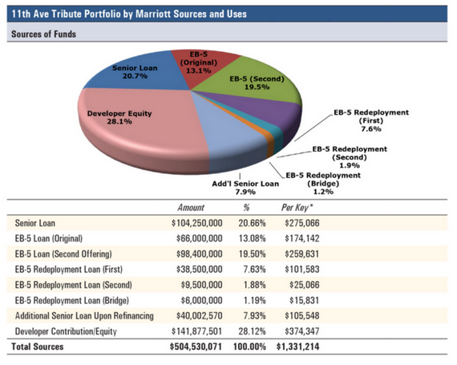
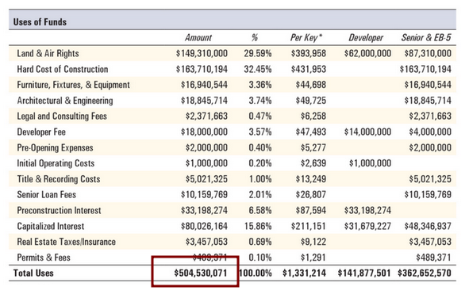

## What is Fund Administration?

Fund administration is a common third-party management function for special purpose vehicles (SPVs) or what many refer to simply as “Funds”. An SPV or a Fund, in basic terms, is an entity designed with the purpose of accepting capital from investors and then using those funds for a specified purpose or enterprise.  Common examples include private equity funds, real estate funds, venture capital funds etc.

Here are two simple examples:
1. A real estate developer forms a real estate fund called RE Fund X to accept capital from outside investors and then deploy that capital into a 500 unit hotel project. Once all of the capital is raised, that capital is being held be RE Fund X. The developer then needs to access the capital to pay for the hotel project – i.e. paying contractors, paying for materials, architects, attorneys etc. The fund administrator’s job is to ensure those funds are being properly allocated, released and spent correctly on the subject hotel project.

2. A venture capital group forms a venture capital fund called VC Fund X. Similar to the above, VC Fund X accepts capital from investors, but, this time the purpose of VC Fund X is to invest in early stage technology companies. Here, the fund administrator may be in charge of ensuring the capital is properly allocated, released and spent on qualifying early-stage companies within VC Fund X’s target class.

Fund administrators serve as a third-party source of integrity while they often also handle much of a Fund’s back-office such as accounting, LP reporting, capital tracking, and capital distributions. 

## What is PRXY and EB5 Proxy?

PRXY is a software provider that owns and operates the EB5 Proxy platform, purpose-built for EB5 fund administrators, with support for:
- recording inbound investments, 
- tracking budget to actual for projects, 
- submission of funding requests (“drawdowns”),
- allows fund administrators to review, approve, and transmit funds,
- calculates jobs created by the expenditure of EB5 capital, an important metric in the process.   

Now is a critical time for the EB5 fund administration due to the recent passage of the [EB5 Reform and Integrity Act of 2022](https://www.congress.gov/bill/117th-congress/house-bill/2471). This legislation mandates that EB5 funds have an independent, third-party fund administrator with the goal of adding additional integrity measures and boosting investor confidence in the EB5 industry.

EB5 Proxy is leading the way to capture the market and is the only option that is backed by the security of blockchain. 

## What is an example of an EB5 Proxy Project?

The [11th Ave Marriott Hotel](http://ny-eb5.com/projects/11th-ave-marriott-tribute/) in midtown Manhattan uses EB5 Proxy software to manage drawdown requests from the builder for items such as concrete, environmental studies, and furniture. The requester uses Confidential Documents (CD) to encrypt and upload files/data to a drawdown request, and that transaction also shares the data. 

> *Tech Note*: The CD `share` transaction encrypts the data to the recipients’ key(s). CD also supports group-based sharing, and in the case of a drawdown, it is shared with the “fund-admin” and “bank/lender” groups. 

> Augusto Lara, Hashed Systems DAO LLC Co-founder, posing with the under construction 11th Ave Marriott Hotel in the background 

## Why does it need a blockchain if EB5 projects use USD Fiat money?

Hashed Network features fund administration primitives that secure the *process* of shared funds, with support for integrating payment systems that may or may not use a blockchain.

The current users receive a lot of value even without final settlement of funds on-chain. The banker role processes the payment using traditional methods, and then attests that it was successful in the app. The general processes in this industry are laborious and time spent handling information sharing is high, so the users love how everything for the project is in “one place”. 

Another inherent benefit to the platform is proof-of-existence guarantees for documentation.

## What type of documentation and process are secured on-chain? 

Fund administration requires careful tracking of fund sources and uses. For example, see the charts below for sources and uses are developed as part of project initiation.

The line items listed as **EB-5 Loans** are funds that require careful administration, and thus the overall project. 

The total amount of funds sources is $504 M. Shown below is the **Use of Funds**, and the total amount is of course the same as the sources.

Even though final settlement of these funds are not yet being executed on-chain, the overall economic process valued at $504 M is secured by the chain. Additional projects valued at ~ $600 M, for a total of $1.1 B, are in queue.

## Why Hashed Network on Polkadot? 

We use Polkadot to secure the immutability and functionality of the blockchain. Polkadot is a large and fast growing ecosystem. In terms of community of developers, it is the fastest growing and second largest blockchain ecosystem. Among many strengths, Polkadot specializes on how various blockchain ecosystems interface among each other, improving compatibility and reach while maintaining flexibility for an unpredictable future.

Hashed Network hosts the pallets and functionality required by the platform.

## How is it secure?

In addition to the security of Polkadot for data and functionality, we use encryption techniques to secure users’ data in a manner where only that user and users the file is shared with can decrypt it. All encryption source code is open source and available for review on Github. 

The encrypted data is saved to InterPlanetary File System (IPFS), a flexible, stable, and widely used decentralized storage layer. Users and applications can subscribe to their storage feeds in the app or with a server.

## What is the Road Map for Fund Administration? 

- Improved integration with [Native Bitcoin Vaults](../2022-10-21-w3f-nbv-m2/index.md), [USD and custodied digital assets](https://commerciumbank.com/), and [Statemint Assets](https://forum.polkadot.network/t/statemint-update-roadmap/1200)
- Milestone budgeting and deliverable tracking 
- Integration with Polkadot governance such as collectives and Governance 2.0
- Use fund administration primitives to manage HASH genesis allocations

