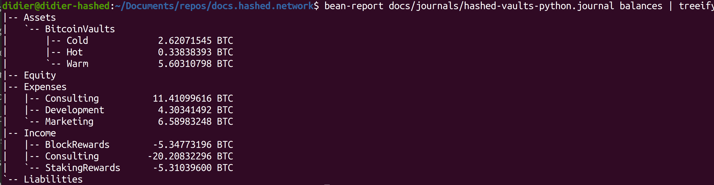
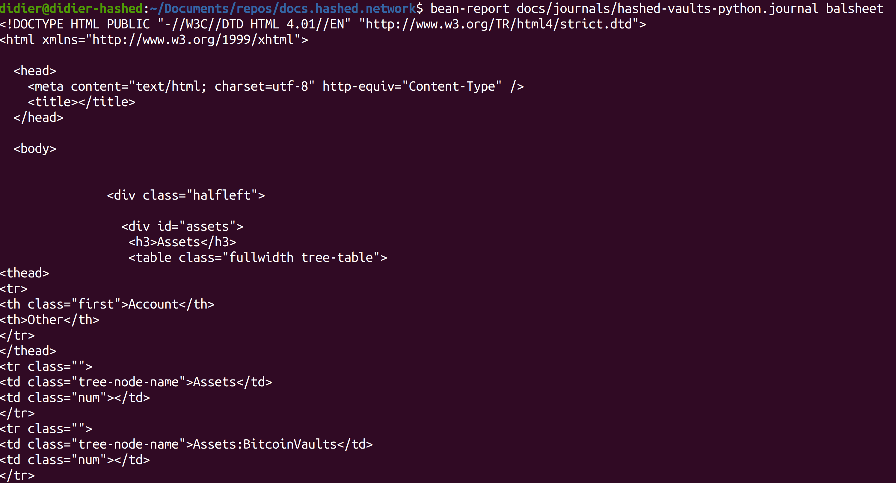
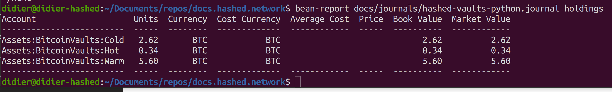

<head>
  <title>Hashed Network Triple Entry Accounting</title>
  <meta charSet="utf-8" />
  <meta property="og:image" content="https://docs.hashed.network/img/monolith.png" />
  <meta property="og:description" content="Triple entry accounting protocol generates journal files from Native Bitcoin Vaults and enables vault administrators to run balance sheets and income statements" />
  <meta property="og:title" content="Hashed Network Triple Entry Accounting" />
  <meta property="og:url" content="https://docs.hashed.network/docs/accounting" />
</head>

[Bitcoin orchestration](nbv.md) and [Native Bitcoin Vaults](https://docs.hashed.network/blog/nbv-m2) address a critical need of managing direct-custody, multisignature bitcoin transactions. For accurate accounting (and likely regulatory compliance), more than a list of UTXOs is required. 

For example, organizations must produce income statements and balance sheets, meaning that the on-chain transaction must be categorized as `Income` or `Expense`, and assigned to a sub-account, such as `Expenses:Netflix`. The on-chain transaction is also assigned to an `Asset` account, which is the generally the inverse of the balancing component.

The transaction information from the chain plus additional information comprise the elements of a journal entry, the core structure of the triple entry accounting protocol. 

As an example, if we received 1.5 BTC to a Cold vault for a consulting gig we completed for Alice, the journal entry would look like this:

```journal
2021-10-10 Received from Alice for Invoice 23    ; 05af3b675ef6dffb20587de089a2a57292c20ff0068bf6a7b5954e64842861c1
    Assets:Bitcoin Vaults:Cold           BTC 1.5 ; bc1qdjcuvjpj2e7d0s47lmcej5yhyr72fmqjm7xe4w
    Income:Consulting
```

All of the data, except for off-setting `Income` and `Expense` accounts, can be derived from Native Bitcoin Vaults.

The accounting protocol adds additional functionality to achieve the outcome:
- Assign and store the off-setting categories (accounts)
- Export `journal` format to corresponding accounting tools (e.g. [hledger](https://hledger.org/install.html), [beancount](https://beancount.github.io/), or others listed [here](https://plaintextaccounting.org/#tools).
- Share journals (encrypted text files) among collaborators using the Confidential Documents protocol

## Fictional Organization Walkthrough

> Follow along by cloning the repo with: `git clone https://github.com/hashed-io/docs.hashed.network.git && cd docs.hashed.network` 

There are many transactions in the sample file. Take a look at the first few transactions.
```bash
head -n 18 docs/journals/hashed-vaults.journal
```

```journal
commodity 1,000.0000 BTC

2021-10-10 Received from Alice for Invoice 23    ; 05af3b675ef6dffb20587de089a2a57292c20ff0068bf6a7b5954e64842861c1
    Assets:Bitcoin Vaults:Cold           BTC 1.5 ; bc1qdjcuvjpj2e7d0s47lmcej5yhyr72fmqjm7xe4w
    Income:Consulting

2021-10-11 Sent to Bob - Deposit                   ; 6595a1894cc976937ddeff4d111df9edf603040008e49d41cedbbc6081f08592
    Assets:Bitcoin Vaults:Hot     BTC -0.10954338  ; bc1qjymg5ggxetpcu9sl2ugdmvkple86n2cqfanhde
    Expenses:Marketing

2021-10-13 Sent to Bob - Project Kickoff                 ; e8db07fba6dcf5d33dae093930f7504035ce7ad35473fbf7efc74fe5c4612246
    Assets:Bitcoin Vaults:Hot           BTC -2.94966474  ; bc1qjymg5ggxetpcu9sl2ugdmvkple86n2cqfanhde
    Expenses:Marketing

2021-10-14 Sent to Charlie to pay Invoice 992               ; d4b977ec4a522e648ddd2e4735a4f4bff32209fa0d2175a8ac5cb20d43bafa28
    Assets:Bitcoin Vaults:Hot           BTC -0.13835373     ; 19Ne2oXRWtWJcKPu8dbbBwDqJqjCJUqpPQ
    Expenses:Development

```

The first line for `commodity` configures the output format of the BTC commodity.

### Balance Sheet
Run a balance sheet to view the total BTC across all vaults. 

> To run the examples, install [hledger](https://hledger.org/install.html). Find more apps, libraries, and GUIs that read the `journal` format at [plaintextaccounting.org](https://plaintextaccounting.org/).

```bash
hledger -f docs/journals/hashed-vaults.journal balancesheet
```

```
Balance Sheet 2021-12-26

                            || 2021-12-26 
============================++============
 Assets                     ||            
----------------------------++------------
 Assets:Bitcoin Vaults:Cold || 2.6207 BTC 
 Assets:Bitcoin Vaults:Hot  || 0.3384 BTC 
 Assets:Bitcoin Vaults:Warm || 5.6031 BTC 
----------------------------++------------
                            || 8.5622 BTC 
============================++============
 Liabilities                ||            
----------------------------++------------
----------------------------++------------
                            ||            
============================++============
 Net:                       || 8.5622 BTC 
```

### Income Statement
An income statement shows the revenues and expenses for the journal. It shows precisely how much BTC came in through the 3 revenue sources of block rewards, consulting, and staking rewards.

```bash
hledger -f docs/journals/hashed-vaults.journal incomestatement
```

```
Income Statement 2021-10-01..2021-12-26

                        || 2021-10-01..2021-12-26 
========================++========================
 Revenues               ||                        
------------------------++------------------------
 Income:Block Rewards   ||             5.3477 BTC 
 Income:Consulting      ||            20.2083 BTC 
 Income:Staking Rewards ||             5.3104 BTC 
------------------------++------------------------
                        ||            30.8665 BTC 
========================++========================
 Expenses               ||                        
------------------------++------------------------
 Expenses:Consulting    ||            11.4110 BTC 
 Expenses:Development   ||             4.3034 BTC 
 Expenses:Marketing     ||             6.5898 BTC 
------------------------++------------------------
                        ||            22.3042 BTC 
========================++========================
 Net:                   ||             8.5622 BTC 

```

This command adds `-M` to show the break-out by month, and `-S` to sort the accounts. There are many configurable options and display types once the data is in the `journal` format.

```bash
hledger -f docs/journals/hashed-vaults.journal incomestatement -S -M
```

```
Income Statement 2021-10-01..2021-12-26

                        ||        Oct          Nov          Dec 
========================++======================================
 Revenues               ||                                      
------------------------++--------------------------------------
 Income:Consulting      || 3.0555 BTC   6.6350 BTC  10.5178 BTC 
 Income:Block Rewards   || 2.1477 BTC   0.9048 BTC   2.2953 BTC 
 Income:Staking Rewards || 2.0026 BTC   1.1026 BTC   2.2052 BTC 
------------------------++--------------------------------------
                        || 7.2058 BTC   8.6424 BTC  15.0183 BTC 
========================++======================================
 Expenses               ||                                      
------------------------++--------------------------------------
 Expenses:Consulting    || 3.1402 BTC   6.1305 BTC   2.1402 BTC 
 Expenses:Marketing     || 3.0592 BTC   2.4304 BTC   1.1002 BTC 
 Expenses:Development   || 0.1384 BTC   3.0267 BTC   1.1384 BTC 
------------------------++--------------------------------------
                        || 6.3378 BTC  11.5876 BTC   4.3788 BTC 
========================++======================================
 Net:                   || 0.8680 BTC  -2.9453 BTC  10.6395 BTC 

```
## Alternative Options
### **Beancount**
Instructions for downloading and installing Beancount on your computer:

**Where to Get It**

This is the official location for the source code:

    https://github.com/beancount/beancount

Download it like this, by using Git to make a clone on your machine:

git clone https://github.com/beancount/beancount

**How to Install**

**Installing Python**

Beancount uses Python 3.51 or above, which is a pretty recent version of Python (as of this writing), and a few common library dependencies.

First, you should have a working Python install. Install the latest stable version >=3.5 using the download from python.org. 

**Installing Beancount using pip**

This is the easiest way to install Beancount. You just install Beancount using

    sudo -H python3 -m pip install beancount

This should automatically download and install all the dependencies.

**Tutorial & example**

First we need to modify the `hashed-vaults.journal` file to be in the Beancount format -> `hashed-vaults-python.journal`. 

You need to take in consideration the following changes:

- Date should be in the format `YYYY-MM-DD`
- Currency should be in the format `USD' 
- After the date, you need to add the `*` symbol
- Every transaction description should be in the format `"description"`
- You need to initialize the account with the `open` keyword
- Account names should be in the format `Assets:BitcoinVaults:Hot`, without spaces
- Beancount will ignore the `;` comments, so you don't need to remove them
- Accounts needs to be balanced:
```bash
    Assets:BitcoinVaults:Cold           1.5 BTC
    Income:Consulting                   -1.5 BTC
```

**Generate an Example File**

If we don't have any doc file, we can begin by generating an example file:

    bean-example > example.beancount

But we already have a `hashed-vaults-python.journal` file, so we can use that one.

Next, before we begin generating reports, verify that the file loads without any errors (checks that the syntax is correct):

    bean-check docs/journals/hashed-vaults-python.journal

It should return quietly, without outputting anything (bean-check only writes errors when there are some, otherwise on success it writes nothing).


**Generating Reports**

Let’s generate a report of the final balances of all accounts:

    bean-report docs/journals/hashed-vaults-python.journal balances


As you can see, the bean-report script has subcommands for the various reports it generates. To list the available reports, use --help-reports:

    bean-report --help-reports


To list the options available for a particular report, use --help on it:

    bean-report docs/journals/hashed-vaults-python.journal balances --help


**Generating Balances**

Good, so we know how to generate a report of balances for all accounts. This is a pretty detailed list of accounts though. Let’s just restrict the output to the accounts that we’re interested in:

    bean-report docs/journals/hashed-vaults-python.journal balances -e BitcoinVaults


**Formatting Tools**

Sometimes it’s nice to render a hierarchical list of accounts as a tree. You can use the “treeify” tool provided by Beancount to do this:

    bean-report docs/journals/hashed-vaults-python.journal balances | treeify




This tool will work on any column of data that looks like a column of account names (you can also configure it work with filenames as well, or other patterns).

**Generating a Balance Sheet and Income Statement**

Let us generate a balance sheet:

    bean-report docs/journals/hashed-vaults-python.journal balsheet




Unfortunately, the only output format supported for it at this point is HTML. Also, filtering balance sheet entries from the command-line is not supported. Generate this to a file and open a browser to it:

    bean-report docs/journals/hashed-vaults-python.journal balsheet > balsheet.html


You can to the same for income statements:

    bean-report docs/journals/hashed-vaults-python.journal income > income.html


**Journals**

You can also generate journals (in Ledger parlance, these are “registers”). Let’s look at a checking account postings, for instance:

    bean-report docs/journals/hashed-vaults-python.journal journal -a Assets:BitcoinVaults:Cold


To render a column of running balances, add the --balance option:

    bean-report docs/journals/hashed-vaults-python.journal journal -a Assets:BitcoinVaults:Cold --balance


**Holdings**

There are a variety of ways to obtain aggregations for the total list of holdings. List the detailed holdings:

    bean-report docs/journals/hashed-vaults-python.journal holdings




**Other Reports**

There are many other miscellaneous reports available. Try a few of those.

Listing all accounts:

    bean-report docs/journals/hashed-vaults-python.journal accounts


**Viewing Reports through the Web Interface**

The original way to access reports in Beancount is via its web interface that serves to a local web server on your machine. Serve the example file like this:

    bean-web docs/journals/hashed-vaults-python.journal

Then navigate with a web browser to http://localhost:8080. From there, you can click on any number of filtered views and access some of the reports previously demonstrated. For example, click on a year view; that will provide balance sheets and income statements and various other reports for this subset of transactions.


---
### **MoneScript**

MoneScript is a double-entry plain-text accounting system that works in your browser. Monescript is a server-less application, all the calculations are performed locally in your browser window without any data leaving your computer.
> Github Repository: [MoneScript BTC](https://github.com/jmgayosso/btc-monescript)

**Journal Syntax**


> * **Transaction format**:
    - YYYY-MM-DD date format
    - BTC currency
    - simple arithmetic value expressions (+, -, *, /)
> * **Comments prefixed with ';' or '#'**
> * **Bucket Command**
> * **tag names**

**Sample MoneScript Journal File**
```journal
2021-10-11 * Sent to Bob - Deposit                   ; 6595a1894cc976937ddeff4d111df9edf603040008e49d41cedbbc6081f08592
    Assets:Bitcoin Vaults:Hot     BTC-0.10954338  ; bc1qjymg5ggxetpcu9sl2ugdmvkple86n2cqfanhde
    Expenses:Marketing

2021-10-13 * Sent to Bob - Project Kickoff                 ; e8db07fba6dcf5d33dae093930f7504035ce7ad35473fbf7efc74fe5c4612246
    Assets:Bitcoin Vaults:Hot           BTC-2.94966474  ; bc1qjymg5ggxetpcu9sl2ugdmvkple86n2cqfanhde
    Expenses:Marketing

2021-10-14 * Sent to Charlie to pay Invoice 992               ; d4b977ec4a522e648ddd2e4735a4f4bff32209fa0d2175a8ac5cb20d43bafa28
    Assets:Bitcoin Vaults:Hot           BTC-0.13835373     ; 19Ne2oXRWtWJcKPu8dbbBwDqJqjCJUqpPQ
    Expenses:Development

```
**Requirements**
 - [Node](https://nodejs.org/en/) >= 16.x.x
 - Npm or [Yarn](https://yarnpkg.com/getting-started/install) installed
 - [Git](https://git-scm.com/)
 
**Tools used**
 - [PegJS](https://pegjs.org/)
 - [Browserify](https://browserify.org/)
 - [Vue](https://vuejs.org/)

**Installation**
 1. Clone the [repository](https://github.com/jmgayosso/btc-monescript)
 2. Execute Yarn or Npm to install all the dependencies
    ```bash
    yarn
    ```
 3. Install [Browserify](https://browserify.org/#install)
 4. Execute the following command to create the file to process the Journal
    ```bash 
    yarn build-grammar
    ```  
 5. Execute the following command to compile the Vue UI and bundle the application, this is ready to deploy in a server using the .html 
    ```bash 
    yarn uib
    ```
 6. Execute the following command to open the application
    ```bash
    yarn start
    ```

**Tutorial & Example**

The user interface
> **Elements**
>  
> `Open Tab` Here you can upload your Journal File [.journal or .txt]
>
> `Transactions Tab` Here you will see the Graphs after upload the journal file


Click on the `open` tab to load your Journal

  

Once loaded the data you will see something like this.
In the following image you can see the Graphs using the Tabs of Monthly Chart & Weekly Chart.

 

**Monthly Chart**


**Weekly Chart**


The UI provides many filters to use.

**Filters**
* Expenses [Button red] 
* Incomes [Button green]
* Month Selector
* Payee
* Tag


**Table Section**

The table reacts to changes when you change between expenses, incomes and assets, and you can see with details the information for each entry in the Journal. This table has the columns date, Amount, Payee and the Account

Expenses

Incomes


---
### **Ledger in Go**

Ledger is a command line application for plain text accounting. Providing commands to view balances, register of transactions, importing of CSV files, and a web interface to view reports, and track investments.
> Github Repository: [Ledger](https://github.com/howeyc/ledger)

### **Installation**
To build the ledger executable from source, you will first need to install Go Follow the instructions on the [Go installation page](https://go.dev/doc/install).

Once you have installed Go, the following command can be used to build and install ledger:
```go
go install github.com/howeyc/ledger/ledger@latest
```
This will automatically download ledger, build it, and install it in Go's global binary directory (~/go/bin/ by default).

**Basic transaction format**

The basic format of a ledger transaction, shown below.
```
2017-06-26 Commonplace Coffee
  Assets:Cash:Wallet           -3.00
  Expenses:Restaurants:Coffee   3.00
```

### **Tutorial & Example**

***Generating Reports***

We can generate a report of the final balances of all accounts.
```
ledger -f ledger.dat bal
```
```
Assets                                                      8.56
Assets:BitcoinVaults                                        8.56
Assets:BitcoinVaults:Cold                                   2.62
Assets:BitcoinVaults:Hot                                    0.34
Assets:BitcoinVaults:Warm                                   5.60
Expenses                                                   22.30
Expenses:Consulting                                        11.41
Expenses:Development                                        4.30
Expenses:Marketing                                          6.58
Income                                                    -30.86
Income:Block Rewards                                       -1.15
Income:BlockRewards                                        -4.20
Income:Consulting                                         -20.20
Income:StakingRewards                                      -5.31
----------------------------------------------------------------
                                                            0.00
```

We can generate a report with specific account by applying a filter.
```
ledger -f docs/journals/hashed-vaults-go.journal bal Income Expenses
```

```
Expenses                                                    22.30
Expenses:Consulting                                         11.41
Expenses:Development                                         4.30
Expenses:Marketing                                           6.58
Income                                                     -30.86
Income:Block Rewards                                        -1.15
Income:BlockRewards                                         -4.20
Income:Consulting                                          -20.20
Income:StakingRewards                                       -5.31
-----------------------------------------------------------------
                                                            -8.56
```

#### By Period
We can generate a report segmented by a time period adding the `--period` flag followed by the period (Monthly,Quarterly,SemiYearly,Yearly).
```
ledger -f docs/journals/hashed-vaults-go.journal --period Monthly  bal Income Expenses
```

```
2021/10/01 - 2021/10/31
================================================================================
Expenses                                                                    6.34
Expenses:Consulting                                                         3.14
Expenses:Development                                                        0.14
Expenses:Marketing                                                          3.06
Income                                                                     -7.20
Income:BlockRewards                                                        -2.15
Income:Consulting                                                          -3.06
Income:StakingRewards                                                      -2.00
--------------------------------------------------------------------------------
                                                                           -0.87

================================================================================
2021/11/01 - 2021/11/30
================================================================================
Expenses                                                                   11.58
Expenses:Consulting                                                         6.13
Expenses:Development                                                        3.03
Expenses:Marketing                                                          2.43
Income                                                                     -8.64
Income:BlockRewards                                                        -0.90
Income:Consulting                                                          -6.63
Income:StakingRewards                                                      -1.10
--------------------------------------------------------------------------------
                                                                            2.94

================================================================================
2021/12/01 - 2021/12/31
================================================================================
Expenses                                                                    4.38
Expenses:Consulting                                                         2.14
Expenses:Development                                                        1.14
Expenses:Marketing                                                          1.10
Income                                                                    -15.01
Income:Block Rewards                                                       -1.15
Income:BlockRewards                                                        -1.15
Income:Consulting                                                         -10.52
Income:StakingRewards                                                      -2.20
--------------------------------------------------------------------------------
                                                                          -10.64
```


#### Account Depth
If we have too many accounts we can trim them to see them added to the second level.
```
ledger -f docs/journals/hashed-vaults-go.journal --period Monthly --depth 2 balance
```
```
2021/10/01 - 2021/10/31
================================================================================
Assets                                                                      0.87
Assets:BitcoinVaults                                                        0.87
Expenses                                                                    6.34
Expenses:Consulting                                                         3.14
Expenses:Development                                                        0.14
Expenses:Marketing                                                          3.06
Income                                                                     -7.20
Income:BlockRewards                                                        -2.15
Income:Consulting                                                          -3.06
Income:StakingRewards                                                      -2.00
--------------------------------------------------------------------------------
                                                                            0.00

================================================================================
2021/11/01 - 2021/11/30
================================================================================
Assets                                                                     -2.94
Assets:BitcoinVaults                                                       -2.94
Expenses                                                                   11.58
Expenses:Consulting                                                         6.13
Expenses:Development                                                        3.03
Expenses:Marketing                                                          2.43
Income                                                                     -8.64
Income:BlockRewards                                                        -0.90
Income:Consulting                                                          -6.63
Income:StakingRewards                                                      -1.10
--------------------------------------------------------------------------------
                                                                            0.00

================================================================================
2021/12/01 - 2021/12/31
================================================================================
Assets                                                                     10.64
Assets:BitcoinVaults                                                       10.64
Expenses                                                                    4.38
Expenses:Consulting                                                         2.14
Expenses:Development                                                        1.14
Expenses:Marketing                                                          1.10
Income                                                                    -15.01
Income:Block Rewards                                                       -1.15
Income:BlockRewards                                                        -1.15
Income:Consulting                                                         -10.52
Income:StakingRewards                                                      -2.20
--------------------------------------------------------------------------------
                                                                            0.00
```

## Protocol Vision

Together with [bitcoin orchestration](nbv.md), the triple entry accounting protocol integrates multiple operational planes into the same user context. 

- Execution layer - transfer-of-value occurs directly on the bitcoin blockchain; scripting and orchestration of signatures via Substrate
- Governance layer - owners and administrators can control which roles or members within an organization or group should have authority
- Accounting layer - users and accountants can construct and share ledgers end-to-end encrypted with audit trail

Businesses adopting the protocol will maintain secure direct-custody, eliminate friction, reduce costs, and improve return on assets.