<head>
  <title>Hashed Network Beancount Integration</title>
  <meta charSet="utf-8" />
  <meta property="og:image" content="https://docs.hashed.network/img/monolith.png" />
  <meta property="og:description" content="On-chain, triple entry accounting protocol generates journal files from Native Bitcoin Vaults and enables vault administrators to run balance sheets and income statements" />
  <meta property="og:title" content="Hashed Network On-chain Accounting" />
  <meta property="og:url" content="https://docs.hashed.network/docs/accounting" />
</head>

Instructions for downloading and installing Beancount:

**Where to Get It**

This is the official location for the source code:

    https://github.com/beancount/beancount

Download it like this, by using Git to make a clone on your machine:

git clone https://github.com/beancount/beancount

**How to Install**

**Installing Python**

Beancount uses Python 3.51 or above, which is a pretty recent version of Python (as of this writing), and a few common library dependencies.

First, you should have a working Python install. Install the latest stable version >=3.5 using the download from python.org. 

**Installing Beancount using pip**

This is the easiest way to install Beancount. You just install Beancount using

    sudo -H python3 -m pip install beancount

This should automatically download and install all the dependencies.

**Tutorial & example**

First we need to modify the `hashed-vaults.journal` file to be in the Beancount format -> `hashed-vaults-python.journal`. 

You need to take in consideration the following changes:

- Date should be in the format `YYYY-MM-DD`
- Currency should be in the format `USD' 
- After the date, you need to add the `*` symbol
- Every transaction description should be in the format `"description"`
- You need to initialize the account with the `open` keyword
- Account names should be in the format `Assets:BitcoinVaults:Hot`, without spaces
- Beancount will ignore the `;` comments, so you don't need to remove them
- Accounts needs to be balanced:
```bash
    Assets:BitcoinVaults:Cold           1.5 BTC
    Income:Consulting                   -1.5 BTC
```

**Generate an Example File**

If we don't have any doc file, we can begin by generating an example file:

    bean-example > example.beancount

But we already have a `hashed-vaults-python.journal` file, so we can use that one.

Next, before we begin generating reports, verify that the file loads without any errors (checks that the syntax is correct):

    bean-check docs/journals/hashed-vaults-python.journal

It should return quietly, without outputting anything (bean-check only writes errors when there are some, otherwise on success it writes nothing).

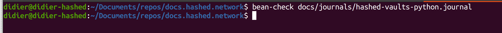

**Generating Reports**

Let’s generate a report of the final balances of all accounts:

    bean-report docs/journals/hashed-vaults-python.journal balances

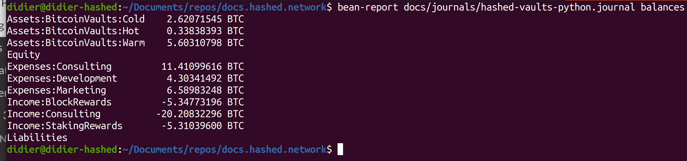


As you can see, the bean-report script has subcommands for the various reports it generates. To list the available reports, use --help-reports:

    bean-report --help-reports


To list the options available for a particular report, use --help on it:

    bean-report docs/journals/hashed-vaults-python.journal balances --help

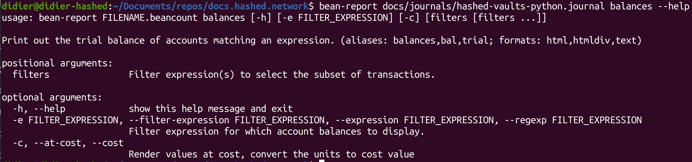


**Generating Balances**

Good, so we know how to generate a report of balances for all accounts. This is a pretty detailed list of accounts though. Let’s just restrict the output to the accounts that we’re interested in:

    bean-report docs/journals/hashed-vaults-python.journal balances -e BitcoinVaults

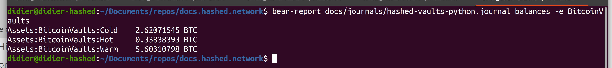


**Formatting Tools**

Sometimes it’s nice to render a hierarchical list of accounts as a tree. You can use the “treeify” tool provided by Beancount to do this:

    bean-report docs/journals/hashed-vaults-python.journal balances | treeify

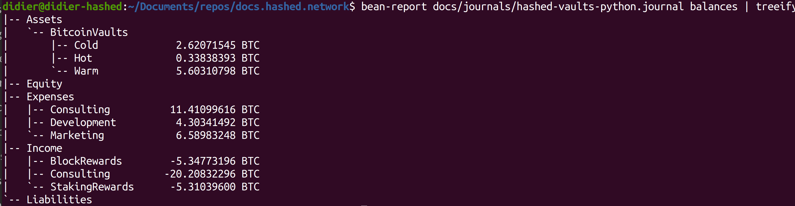


This tool will work on any column of data that looks like a column of account names (you can also configure it work with filenames as well, or other patterns).

**Generating a Balance Sheet and Income Statement**

Let us generate a balance sheet:

    bean-report docs/journals/hashed-vaults-python.journal balsheet

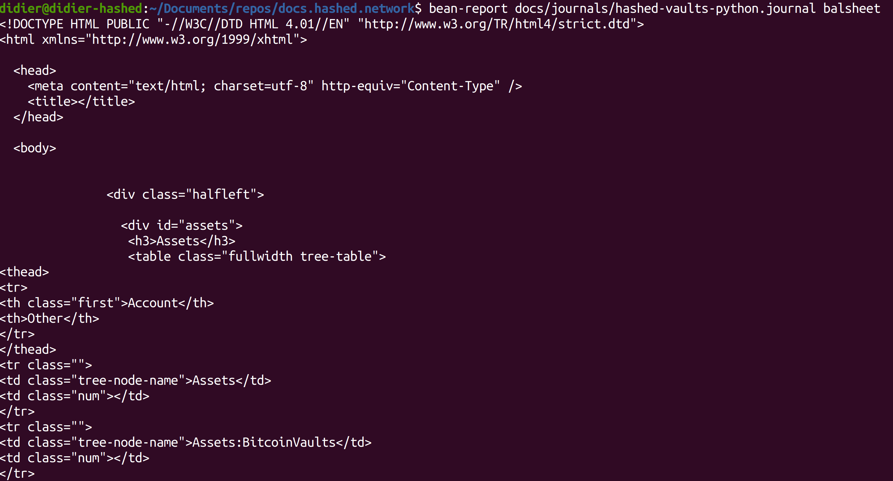


Unfortunately, the only output format supported for it at this point is HTML. Also, filtering balance sheet entries from the command-line is not supported. Generate this to a file and open a browser to it:

    bean-report docs/journals/hashed-vaults-python.journal balsheet > balsheet.html

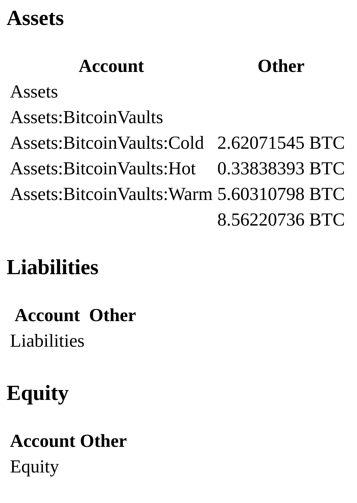


You can to the same for income statements:

    bean-report docs/journals/hashed-vaults-python.journal income > income.html

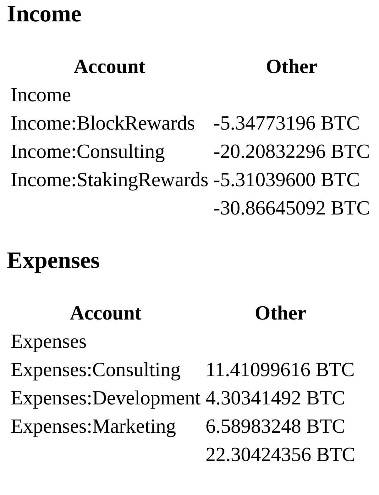


**Journals**

You can also generate journals (in Ledger parlance, these are “registers”). Let’s look at a checking account postings, for instance:

    bean-report docs/journals/hashed-vaults-python.journal journal -a Assets:BitcoinVaults:Cold

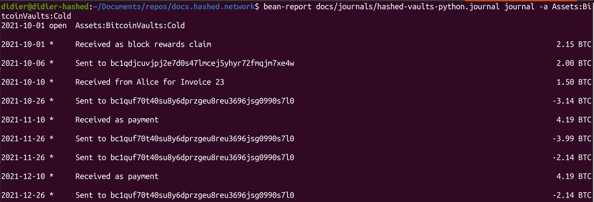


To render a column of running balances, add the --balance option:

    bean-report docs/journals/hashed-vaults-python.journal journal -a Assets:BitcoinVaults:Cold --balance

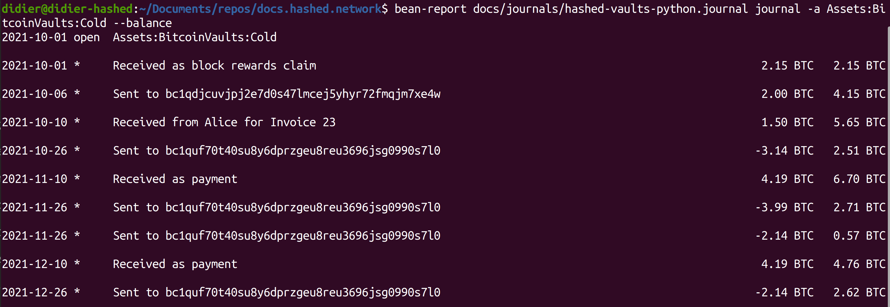


**Holdings**

There are a variety of ways to obtain aggregations for the total list of holdings. List the detailed holdings:

    bean-report docs/journals/hashed-vaults-python.journal holdings

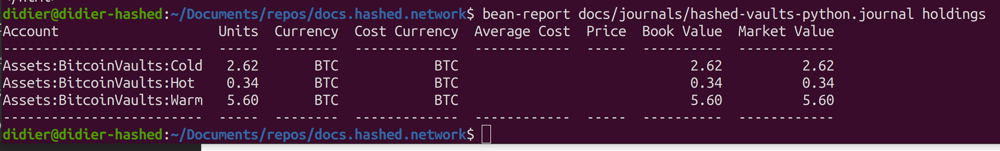


**Other Reports**

There are many other miscellaneous reports available. Try a few of those.

Listing all accounts:

    bean-report docs/journals/hashed-vaults-python.journal accounts


**Viewing Reports through the Web Interface**

The original way to access reports in Beancount is via its web interface that serves to a local web server on your machine. Serve the example file like this:

    bean-web docs/journals/hashed-vaults-python.journal

Then navigate with a web browser to http://localhost:8080. From there, you can click on any number of filtered views and access some of the reports previously demonstrated. For example, click on a year view; that will provide balance sheets and income statements and various other reports for this subset of transactions.

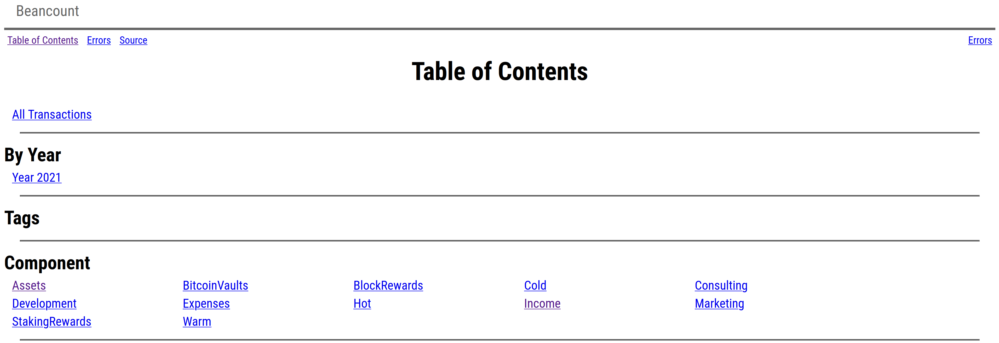
