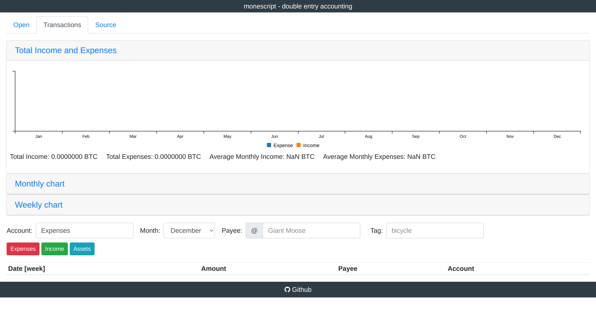
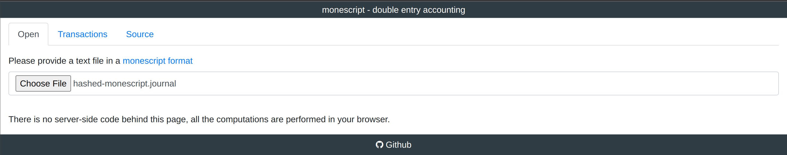
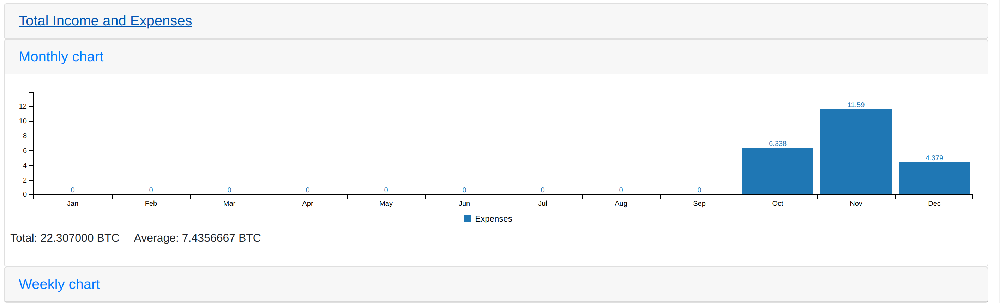
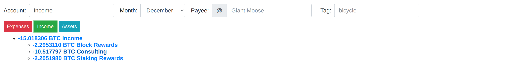
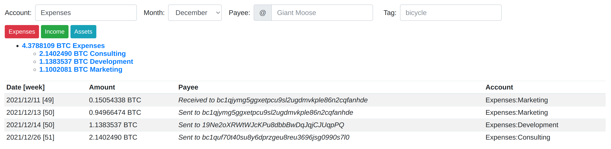

<head>
  <title>Hashed Network MoneScript Integration</title>
  <meta charSet="utf-8" />
  <meta property="og:image" content="https://docs.hashed.network/img/monolith.png" />
  <meta property="og:description" content="On-chain, triple entry accounting protocol generates journal files from Native Bitcoin Vaults and enables vault administrators to run balance sheets and income statements" />
  <meta property="og:title" content="Hashed Network On-chain Accounting" />
  <meta property="og:url" content="https://docs.hashed.network/docs/accounting" />
</head>

MoneScript is a double-entry plain-text accounting system that works in your browser. Monescript is a server-less application, all the calculations are performed locally in your browser window without any data leaving your computer.
> Github Repository: [MoneScript BTC](https://github.com/jmgayosso/btc-monescript)

**Journal Syntax**


> * **Transaction format**:
    - YYYY-MM-DD date format
    - BTC currency
    - simple arithmetic value expressions (+, -, *, /)
> * **Comments prefixed with ';' or '#'**
> * **Bucket Command**
> * **tag names**

**Sample MoneScript Journal File**
```journal
2021-10-11 * Sent to Bob - Deposit                   ; 6595a1894cc976937ddeff4d111df9edf603040008e49d41cedbbc6081f08592
    Assets:Bitcoin Vaults:Hot     BTC-0.10954338  ; bc1qjymg5ggxetpcu9sl2ugdmvkple86n2cqfanhde
    Expenses:Marketing

2021-10-13 * Sent to Bob - Project Kickoff                 ; e8db07fba6dcf5d33dae093930f7504035ce7ad35473fbf7efc74fe5c4612246
    Assets:Bitcoin Vaults:Hot           BTC-2.94966474  ; bc1qjymg5ggxetpcu9sl2ugdmvkple86n2cqfanhde
    Expenses:Marketing

2021-10-14 * Sent to Charlie to pay Invoice 992               ; d4b977ec4a522e648ddd2e4735a4f4bff32209fa0d2175a8ac5cb20d43bafa28
    Assets:Bitcoin Vaults:Hot           BTC-0.13835373     ; 19Ne2oXRWtWJcKPu8dbbBwDqJqjCJUqpPQ
    Expenses:Development

```
**Requirements**
 - [Node](https://nodejs.org/en/) >= 16.x.x
 - Npm or [Yarn](https://yarnpkg.com/getting-started/install) installed
 - [Git](https://git-scm.com/)
 
**Tools used**
 - [PegJS](https://pegjs.org/)
 - [Browserify](https://browserify.org/)
 - [Vue](https://vuejs.org/)

**Installation**
 1. Clone the [repository](https://github.com/jmgayosso/btc-monescript)
 2. Execute Yarn or Npm to install all the dependencies
    ```bash
    yarn
    ```
 3. Install [Browserify](https://browserify.org/#install)
 4. Execute the following command to create the file to process the Journal
    ```bash 
    yarn build-grammar
    ```  
 5. Execute the following command to compile the Vue UI and bundle the application, this is ready to deploy in a server using the .html 
    ```bash 
    yarn uib
    ```
 6. Execute the following command to open the application
    ```bash
    yarn start
    ```

**Tutorial & Example**

The user interface
> **Elements**
>  
> `Open Tab` Here you can upload your Journal File [.journal or .txt]
>
> `Transactions Tab` Here you will see the Graphs after upload the journal file



Click on the `open` tab to load your Journal

  

Once loaded the data you will see something like this.
In the following image you can see the Graphs using the Tabs of Monthly Chart & Weekly Chart.

 

**Monthly Chart**


**Weekly Chart**


The UI provides many filters to use.

**Filters**
* Expenses [Button red] 
* Incomes [Button green]
* Month Selector
* Payee
* Tag


**Table Section**

The table reacts to changes when you change between expenses, incomes and assets, and you can see with details the information for each entry in the Journal. This table has the columns date, Amount, Payee and the Account

Expenses

Incomes
