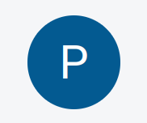

<head>
  <title>Creating Your First Polkadot Account</title>
  <meta charSet="utf-8" />
  <meta property="og:image" content="https://docs.hashed.network/img/fund-admin.png" />
  <meta property="og:description" content="On-chain, triple entry accounting protocol generates journal files from Native Bitcoin Vaults and enables vault administrators to run balance sheets and income statements" />
  <meta property="og:title" content="Creating Your First Polkadot Account" />
  <meta property="og:url" content="https://docs.hashed.network/docs/fund-admin/polkadot-account" />
</head>

## **Introduction**
Before to start, you must have:
- A Polkadot account
- The Polkadot extension installed on your browser
- Your Polkadot account connected to the Polkadot extension
- An administrator from the Fund Administration website has added you to the list of users

All the steps to create and
connect your Polkadot account to the Polkadot extension are explained in this [guide](./polkadot-account.md#introduction).

**Note**: The first time you enter to the `Fund Administration` website, you may be asked to `Authorize` the Polkadot extension. You can do it by clicking on the `Yes, allow this application access` button.

Your Polkadot extension should look like this:

**Note**: If you have more than one account, all of them will be displayed in the Polkadot extension.

## **How to login**
1. First of all, you need to go to the [Fund Administration](https://prxyco.com/) landing page:

2. Click on the `Connect` button (right top corner):

3. Then, you will be redirected to the following login page:

**Note**: For this step, you must have your Polkadot account connected to the Polkadot extension. If you haven't done it yet, you will see a different screen without the dropdown menu.

If you click on the `Connect with Polkadot` button, you will be redirected to the Official [Polkadot extension](https://polkadot.js.org/extension/) page.
Please follow our guide [here](./polkadot-account.md#introduction) to connect your Polkadot account to the Polkadot extension.

4. Select your Polkadot account from the dropdown menu and click on the `Connect with Polkadot` button.

5. A Polkadot extension popup will appear:

6. Introduce your password (the one you used to create your Polkadot account):

**Note**: If you will be signing a lot of transactions, you can check the `Remember my password for the next 15 minutes` option to avoid typing your password every time.

**Note**: If your password doesn't match, you will see the following error message:

**Note**: There's a limit of time to sign a transaction. If you don't sign it within the time limit, you will see the following error message:

7. Click on the `Sign the message` button.

**WARNING**: If any administrator has added you to the list of users, you will see the following error message:

8. After you login, the next screen you will see depends on your role & if you have any project assigned to you:

**Administrator's view**:

**Investor's view**:

**Builder's view**:

9. We're done! You can start using the `Fund Administration` website.

--- 

## **How to logout**
1. Once you're done using the `Fund Administration` website, look for your `Profile` icon, usually located on the right top corner of the screen:

2. Then you will be redirected to the `Profile` page where you can edit your profile information and logout:

3. Click on the `Logout` button:

4. You will be redirected to the `Fund Administration` login page:

5. We're done! You have successfully logged out from the `Fund Administration` website.