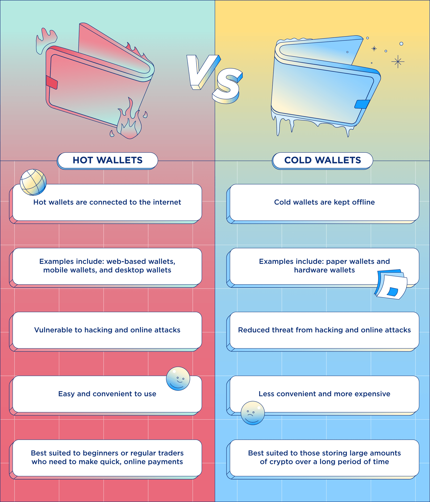

<head>
  <title>Polkadot Key Concepts</title>
  <meta charSet="utf-8" />
  <meta property="og:image" content="https://docs.hashed.network/img/fund-admin.png" />
  <meta property="og:description" content="On-chain, triple entry accounting protocol generates journal files from Native Bitcoin Vaults and enables vault administrators to run balance sheets and income statements" />
  <meta property="og:title" content="Key Concepts" />
  <meta property="og:url" content="https://docs.hashed.network/docs/fund-admin/polkadot-key-concepts" />
</head>

The following information, cover the key concepts of the Polkadot ecosystem.
- [**What Is Polkadot (DOT)?**](#what-is-polkadot-dot)
- [**How Does Polkadot Work?**](#how-does-polkadot-work)
- [**Accounts**](#accounts)
  - [**Account Address**](#account-address)
  - [**Public and Private Keys**](#public-and-private-keys)
  - [**Mnemonic and Address Generation**](#mnemonic-and-address-generation)
  - [**Multi-signature accounts**](#multi-signature-accounts)
  - [**Wallets**](#wallets)
  - [**Different Types of Crypto Wallets**](#different-types-of-crypto-wallets)
    - [**Hot Wallets**](#hot-wallets)
    - [**Cold Wallets**](#cold-wallets)
  - [**Hot Wallets vs Cold Wallets: Which is Better?**](#hot-wallets-vs-cold-wallets-which-is-better)

## **What Is Polkadot (DOT)?**
Polkadot is a scalable, secure, and decentralized multi-chain network for the next web, built using Substrate – a framework enabling the creation of compatible and purpose-built blockchains composed of custom or pre-built components.

DOT is the native token currency of the Polkadot network. It facilitates payments, network governance, staking, reward incentives, transaction fees, and other bonding processes – where tokens are locked up as part of connecting new chains to the Polkadot network or taking on another role in the ecosystem.

## **How Does Polkadot Work?**

Polkadot allows funds to be sent from one digital wallet to another, using a system of public and private key cryptography. The hash of the public key is the address you give out to receive funds and the private key acts like a password, authorizing and broadcasting transactions to the network. Approximately every six seconds, these pending transactions are confirmed in a block of transactions, and together the blocks form the Polkadot blockchain.**

Polkadot allows funds to be sent from one digital wallet to another, using a system of public and private key cryptography. The hash of the public key is the address you give out to receive funds and the private key acts like a password, authorizing and broadcasting transactions to the network. Approximately every six seconds, these pending transactions are confirmed in a block of transactions, and together the blocks form the Polkadot blockchain.

## **Accounts**
An account represents an identity—usually of a person or an organization—that is capable of making transactions or holding funds. 

Although accounts are most often used to represent a person, that doesn't have to be the case. An account can be used to perform operations on behalf of a user or another entity, or to perform operations autonomously. In addition, any single person or entity could have multiple accounts for different purposes. For example, Polkadot is a Substrate-based blockchain that has specialized accounts for holding funds that are separate from accounts used for making transactions.

### **Account Address**
An address is the public part of a Polkadot account. The private part is the key used to access this address. The public and private parts together make up a Polkadot account. You can think of the public address of your account like your mailbox and the private key like the key to open that mailbox. Anybody can send mail to your mailbox, but only you can access them as only you have access to its key. In the context of Polkadot accounts, anybody can send tokens to your public address but only you can transact with them using your private key. That is why you should keep your private key secret.

### **Public and Private Keys**
In general, every account has an owner who possesses a public and private key pair. 

The `private key` is a cryptographically-secure sequence of randomly-generated numbers. For human readability, the private key generates a random sequence of words called a secret seed phrase or mnemonic. The secret seed phrase is important because it can be used to recover access to an account if the private key is lost. 

For most networks, the `public key` associated with an account is how that account is identified on the network and some form of it is used as the destination address for transactions. 

However, Substrate-based chains use the underlying public key to derive one or more public addresses. 

### **Mnemonic and Address Generation**

A mnemonic is a pattern of letters, words, or associations which allows you to easily remember information, and has been used by humans for thousands of years. In other words, it can be a very useful tool to help us memorize important information we need to remember.

A typical mnemonic phrase generated by the Subkey tool is shown below.

    'caution juice atom organ advance problem want pledge someone senior holiday very'
Its corresponding private/public keypair is also shown.

    Secret seed (Private key): 0x056a6a4e203766ffbea3146967ef25e9daf677b14dc6f6ed8919b1983c9bebbc
    Public key (SS58): 5F3sa2TJAWMqDhXG6jhV4N8ko9SxwGy8TpaNS1repo5EYjQX

### **Multi-signature accounts**

Typically, an account has one and only one owner and that owner holds the private key for signing transactions. The Multisig pallet enables you to configure a specialized account for executing transactions that multiple account owners must approve. The multisig account is an address that has a public key, but no private key. The public address for the multisig account is derived from a deterministic list of the authorized account signatories

### **Wallets**
Crypto wallets hold the private keys to your cryptocurrency and keep them safe. They come in several varieties, and they can be either physical devices, software programs or online services.

A wallet doesn’t actually hold your coins. Instead, it holds the key to your coins which are actually stored on public blockchain networks. 

If you are wondering, "What is the best wallet for DOT?" You will be happy to hear that there are several teams developing wallets for DOT tokens at the moment, including cold storage (offline) options. 

### **Different Types of Crypto Wallets**

There are two main types of crypto wallets: software-based hot wallets and physical cold wallets. Read on to learn about the different types of cryptocurrency wallets, and which is best for you and your needs. 

The main difference between hot and cold wallets is whether they are connected to the Internet. Hot wallets are connected to the Internet, while cold wallets are kept offline. This means that funds stored in hot wallets are more accessible, and are easier for hackers to gain access to.

#### **Hot Wallets**

In hot wallets, private keys are stored and encrypted on the app itself, which is kept online. Using a hot wallet can be risky because computer networks have hidden vulnerabilities that can be targeted by hackers or malware programs to break into the system.

Examples of hot wallets include:

    - Web-based wallets
    - Mobile wallets
    - Desktop wallets

The following hot wallets have been developed by Parity: 
  
- [Polkadot browser extension](./polkadot-account.md#polkadot-browser-extension)
- [Polkadot-JS UI](./polkadot-account.md#polkadot-user-interface-ui)
- Subkey (needs technical knowledge)
- Parity Signer

#### **Cold Wallets**
A cold wallet is entirely offline. While they’re certainly not as convenient as hot wallets, they are far more secure. An example of a physical medium used for cold storage is a piece of paper or an engraved piece of metal.

Examples of cold wallets include:

- Paper wallets: A paper wallet is a physical location where the private and public keys are written down or printed. In many ways, this is safer than keeping funds in a hot wallet, since remote hackers have no way of accessing these keys which are kept safe from phishing attacks. On the other hand, it opens up the potential risk of the piece of paper getting destroyed or lost, which may result in irrecoverable fund

- Hardware wallets: A hardware wallet is an external device (usually a USB or Bluetooth device) that stores your keys. You can only sign a transaction by pushing a physical button on the device, which malicious actors cannot control.

### **Hot Wallets vs Cold Wallets: Which is Better?**
While both methods of storage have benefits and drawbacks, the option you choose will depend on what you are looking for. For example:

    If you plan to trade day-to-day, then accessibility will be of paramount importance, meaning that a hot wallet is probably an appropriate choice.
    However, if you are considering storing a huge amount of crypto assets and value security over convenience, then it might be wise to invest in a cold wallet.

