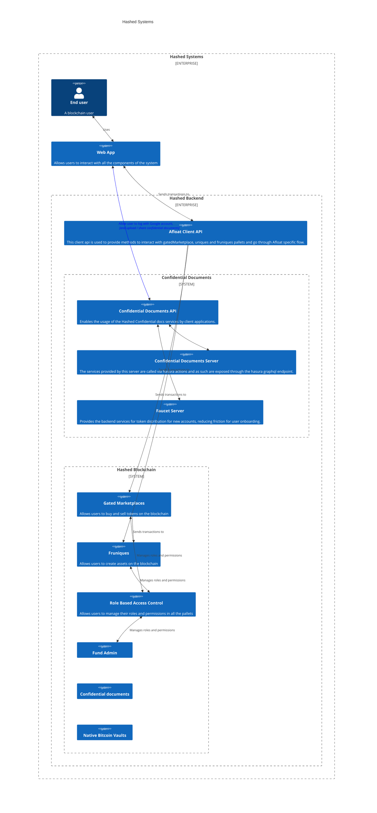

Hashed Systems is a blockchain based platform that allows users to create and manage their own marketplaces, and to create and manage their own assets. It is built on top of Substrate, and uses the Afloat framework.

## **Components**

| Component | Description |
| ----- | ----------- |
| **Afloat Client API** | This client api is used to provide methods to interact with gatedMarketplace, uniques and fruniques pallets and go through Afloat specific flow. |
| **Marketplace UI** | This is the UI for the Hashed Network Portal, it allows users to interact with all the components of the system. |
| **Marketplace pallet** | This pallet allows users to create and manage their own marketplaces. |
| **Fruniques pallet** | This pallet allows users to create and manage their own fractional assets. It's build on top of Uniques pallet |
| **Confidential Documents Server** | This server provides the backend services for the Hashed Confidential docs services. |
| **Confidential Documents API** | This client api is used to provide methods to interact with the Hashed Confidential docs services. |
| **Faucet Server** | This server provides the backend services for token distribution for new accounts, reducing friction for user onboarding. |

**Repositories**
(all MIT licensed)

| Component | Repo | Language |
| ----- | ----------- | ------- |
| Afloat Client API | https://github.com/hashed-io/afloat-client-api | Javascript |
| Marketplace UI | https://github.com/hashed-io/hashed-network-portal-ui | Quasar/Vue |
| Marketplace pallet | https://github.com/hashed-io/hashed-substrate/tree/develop/pallets/gated-marketplace | Rust |
| Fruniques pallet | https://github.com/hashed-io/hashed-substrate/tree/develop/pallets/fruniques | Rust |
| Confidential Documents Server | https://github.com/hashed-io/hashed-private-server | Javascript |
| Confidential Documents API | https://github.com/hashed-io/hashed-confidential-docs-client-api | Javascript |
| Faucet Server | https://github.com/hashed-io/faucet-server | Javascript |

## General architecture Diagram



## How to deploy and configure a full system locally.

### Prerequisites

You need some tools to be able to run the system locally.

- [Substrate](https://docs.substrate.io/install/)
- [NodeJS 16](https://nodejs.org/en/download/)
- [yarn](https://classic.yarnpkg.com/en/docs/install/#debian-stable)


### Deploying the blockchain
Clone the [Hashed Substrate](https://github.com/hashed-io/hashed-substrate) repo, and checkout the develop branch.

```bash
git clone git@github.com:hashed-io/hashed-substrate.git
cd hashed-substrate
git checkout develop
```

#### Running a local node

```bash
cargo run --bin hashed --release -- --dev
```
#### Setup the pallets

Go to the [Polkadot webside](https://polkadot.js.org/apps/?rpc=ws%3A%2F%2F127.0.0.1%3A9944#/explorer), make sure you are connected to the local node.

- Go to the `Developer` tab and click on `Sudo`
- Select `gatedMarketplace` pallet and search for the extrinsic `initialSetup()`, then click on `Submit Transaction`
- Select `fruniques` pallet and search for the extrinsic `initialSetup()`, then click on `Submit Transaction`

This steps are required in order to setup the pallets and create the required roles and permissions.

### Faucet Server

You would need to run the faucet locally, this is the repo for it: https://github.com/hashed-io/faucet-server, there is a README file explaining how to run it but you should be able to run it with the following command:

```bash
npm run start:all image
```

Before running the faucet you should have the node running locally, as the faucet connects to it, this is configured in the .env.all file.
You would also need to updated the front-end env file, to point to the local faucet:

```bash
FAUCET_SERVER_URL = 'http://localhost:3000'
```
