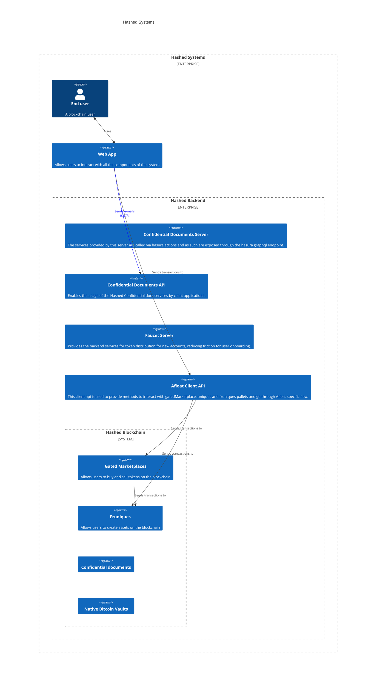

**Repositories**
(all MIT licensed)
| Component | Repo | Language |
| ----- | ----------- | ------- |
| Afloat Client API | https://github.com/hashed-io/afloat-client-api | Javascript |
| Marketplace UI | https://github.com/hashed-io/hashed-network-portal-ui | Quasar/Vue |
| Marketplace pallet | https://github.com/hashed-io/hashed-substrate/tree/develop/pallets/gated-marketplace | Rust |
| Fruniques pallet | https://github.com/hashed-io/hashed-substrate/tree/develop/pallets/fruniques | Rust |
| Confidential Documents Server | https://github.com/hashed-io/hashed-private-server | Javascript |
| Confidential Documents API | https://github.com/hashed-io/hashed-confidential-docs-client-api | Javascript |
| Faucet Server | https://github.com/hashed-io/faucet-server | Javascript |

## General architecture Diagram



## How to deploy and configure a full system locally.

### Prerequisites

You need some tools to be able to run the system locally.

- [Substrate](https://docs.substrate.io/install/)
- [NodeJS 16](https://nodejs.org/en/download/)
- [yarn](https://classic.yarnpkg.com/en/docs/install/#debian-stable)


### Deploying the blockchain
Clone the [Hashed Substrate](https://github.com/hashed-io/hashed-substrate) repo, and checkout the develop branch.

```bash
git clone git@github.com:hashed-io/hashed-substrate.git
cd hashed-substrate
git checkout develop
```

#### Running a local node

```bash
cargo run --bin hashed --release -- --dev
```
