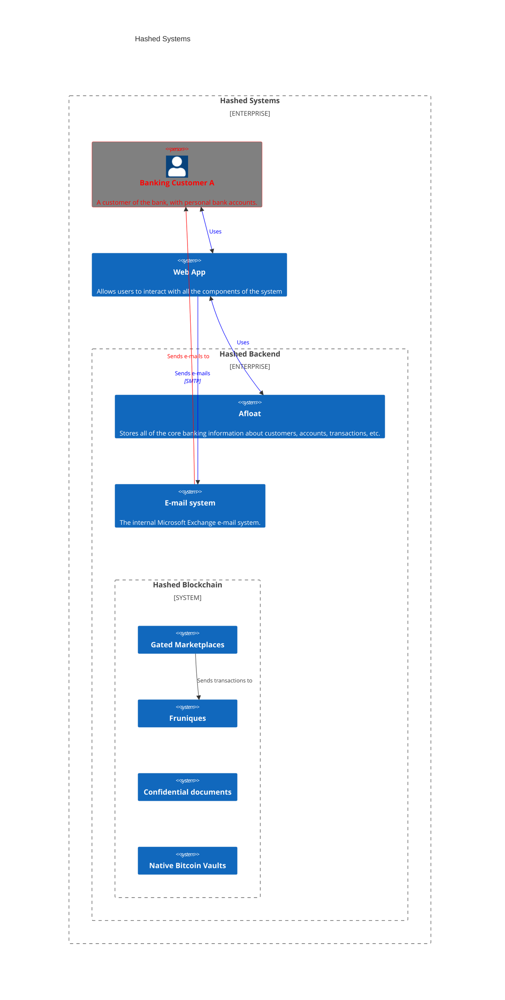

Provide a general architecture guide that describes the different repos and how they interact with each other.

Provide a doc that describes how to deploy and configure a full system locally.

```mermaid
    C4Context
      title Hashed Systems
      Enterprise_Boundary(b0, "Hashed Systems") {
        Person(customerA, "Banking Customer A", "A customer of the bank, with personal bank accounts.")

        System(WebAA, "Web App", "Allows users to interact with all the components of the system")

        Enterprise_Boundary(b1, "Hashed Backend") {

          System(SystemE, "Afloat", "Stores all of the core banking information about customers, accounts, transactions, etc.")

          System_Boundary(b2, "Hashed Blockchain") {
            System(SystemA, "Gated Marketplaces")
            System(SystemB, "Fruniques")
            System(SystemF, "Confidential documents")
            System(SystemG, "Native Bitcoin Vaults")
          }

          System(SystemC, "E-mail system", "The internal Microsoft Exchange e-mail system.")
        }
      }

      BiRel(customerA, WebAA, "Uses")
      BiRel(WebAA, SystemE, "Uses")
      Rel(WebAA, SystemC, "Sends e-mails", "SMTP")
      Rel(SystemC, customerA, "Sends e-mails to")
      Rel(SystemA, SystemB, "<br>Sends transactions to")

      UpdateElementStyle(customerA, $fontColor="red", $bgColor="grey", $borderColor="red")
      UpdateRelStyle(customerA, WebAA, $textColor="blue", $lineColor="blue", $offsetX="5")
      UpdateRelStyle(WebAA, SystemE, $textColor="blue", $lineColor="blue", $offsetY="-10")
      UpdateRelStyle(WebAA, SystemC, $textColor="blue", $lineColor="blue", $offsetY="-40", $offsetX="-50")
      UpdateRelStyle(SystemC, customerA, $textColor="red", $lineColor="red", $offsetX="-50", $offsetY="20")

      UpdateLayoutConfig($c4ShapeInRow="2", $c4BoundaryInRow="1")

```