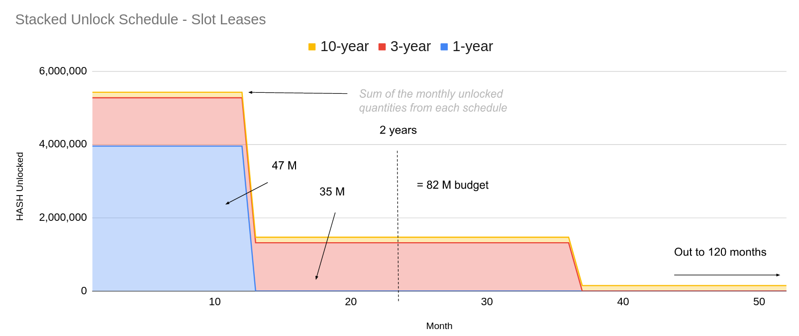

*The purpose of HASH is to proactively and automatically manage the health of the network through programmatic incentives.*

Genesis allocations were derived using a 3-step process from an analysis of the Polkadot parachains listed on [parachains.info](https://parachains.info).

1. Data collection - recorded the genesis allocations for each parachain and candidate (n=170)
2. Data cleansing - labels used for the allocations (pie charts) are inconsistent across chains, so we mapped each of the allocations into a consistent structure (as defined below)
3. Aggregate and score - with a clean data set, we were able to aggregate all parachains into a consistent score for each allocation category.

### Allocation Categories in Analysis
 |Category|Subcategory|Definition|
    |---|---|---|
    |Founding Team|Founding Team|Individuals/companies responsible for establishing and executing the Network vision since conception|
    |Investors|Seed|Initial round of fundraising|
    |Investors|Strategic|Second and subsequent round(s) of fundraising if needed|
    |Budgets|
    ||Community|Funds allocated to engage and support general token holders and ambassadors (“fans”)|
    ||Ecosystem|Funds allocated to support applications and organizations using Hashed Network (“users”)|
    ||Marketing|Funds allocated to drive awareness of the benefits and features of the Hashed Network|
    ||Development|Funds allocated to continue building the base protocol, pallets, and network services|
    |Slot Leases|
    ||Crowdloan|Rewards paid to accounts that contribute to a crowdloan resulting in a successful parachain lease; includes initial campaign and reserve|
    ||Auctions|Funds allocated to directly swap or stake for a parachain slot; not limited to any specific auction|
    |Reserve|Reserve|Funds with no specific allocation, such as *treasury* or *reserve*|
    
### Prototypical Genesis Allocations
The following pie chart shows a prototypical genesis allocation of other parachains and parachain candidates (data as of Nov 2022). Hashed Network uses this allocation as the starting point and applies changes as necessary via governance.

> Since auctions and crowdloans are both part of the slot lease process, Hashed Network combines them into the "Slot Leases" allocation but we've left them separate below for the data point. 

For more information on the analysis, see the [repo](https://github.com/hashed-io/hashed-genesis-token-distribution-scraping) or the [Google Slides](https://docs.google.com/presentation/d/1I76PNeaiZG2dp0qnGQZkDltaiow3M7looPuY6PHUJdQ/edit?usp=sharing). The slides contain a previous data set; repo is generally current; the Nov 2022 snapshot was used for Hashed Network genesis.

### Vesting

Vesting records were created for each of the genesis allocations. The vesting pallet supports linear vesting, so the Network created 3 records per allocation in order to provide a balanced curve. A- and B-vesting are both 42% and C-vesting is 16%, for a total of 100% of that allocation to be vested over the duration of C. With variations based on the specific allocation, A-vesting occurs in the first 1-3 years, B-vesting in 2-5 years, and C-vesting is 3-10 years.

These are the rates at which HASH becomes available to the allocations. Each of the allocations will have also have a burn rate for un-used HASH. These parameters will be decided via governance in months 12-18.

#### Vesting and budgeting for crowdloan rewards
The chart below shows the vesting, or **unlock** schedule for the **Slot Leases** allocation.

The chart above is part of a pre-chain governance proposal to execute a public crowdloan campaign with a reward pool of 6% of the total HASH supply. Crowdloan participants will be rewarded with HASH linearly over the duration of the lease. 

 |Key Metric|Value|
    |---|---|
    |Reward Pool|60,000,000 HASH|
    |Crowdloan Cap|125,000 DOT|
    |HASH per Staked-DOT ratio|480 HASH|

:::caution

The most accurate information about tokenomics and governance is on-chain. 
:::
