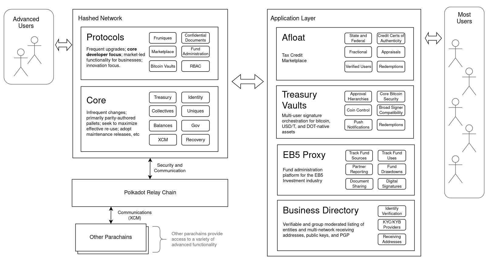

<head>
  <title>Hashed Network Component Overview</title>
  <meta charSet="utf-8" />
  <meta property="og:image" content="https://docs.hashed.network/img/network-components.png" />
  <meta property="og:description" content="Hashed Network hosts several pallets that are purpose-built for useful functionality for businesses. Applications and products build and operate using Network pallets." />
  <meta property="og:title" content="Hashed Network Component Overview" />
  <meta property="og:url" content="https://docs.hashed.network/docs/intro" />
</head>

Hashed Network hosts several pallets that are purpose-built for useful functionality for businesses. Applications and products build and operate using Network pallets.

Advanced users may access the Network directly, such as through `polkadot-js`, but most users will access the Network through one of the independent applications.

