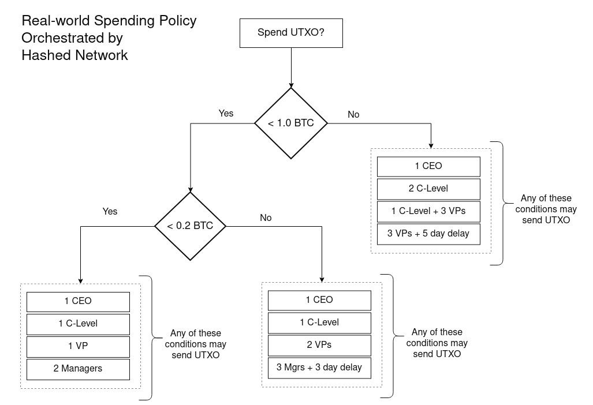

<head>
  <title>Bitcoin Orchestration</title>
  <meta charSet="utf-8" />
  <meta property="og:image" content="https://docs.hashed.network/img/taproot-example.png" />
  <meta property="og:description" content="The bitcoin orchestrator generates the scripts and Schnoor addresses based on the configuration and business rules. The following diagram shows how a real-world spending policy would be translated to Tapscript and implemented with Hashed Network bitcoin orchestration." />
  <meta property="og:title" content="Bitcoin Orchestration" />
  <meta property="og:url" content="https://docs.hashed.network/docs/nbv" />
</head>

Recent innovations in bitcoin, such as [BIP 174](https://en.bitcoin.it/wiki/BIP_0174), and the taproot upgrade, [BIP 340](https://en.bitcoin.it/wiki/BIP_0340), [BIP 341](https://en.bitcoin.it/wiki/BIP_0341), and [BIP 342](https://en.bitcoin.it/wiki/BIP_0342), enables developers to de-couple the signing experience from the orchestration of transactions. For example, BIP 174 introduced the now widely supported partially signed bitcoin transaction (PSBT) format for multisignature wallets. 

Bitcoin orchestration is used to generate receiving addresses, verify ownership of treasuries, and proof of reserves reporting. The intermediate payloads (not private keys) may be encrypted or shared with a group. Compatible bitcoin signers include BlueWallet, in-browser via Hashed key vault, and more coming soon.

Users create an extended public key with their preferred signer, and verify that public key on Hashed Network (via QR code). When multiple users (or multiple accounts or security levels of the same user) attest to these keys on-chain, the pallet and off-chain workers orchestrate the process for signers. 

BIP 174 supports a limited number of signers per wallet, and lacks the scalability and privacy-preserving features of taproot.

## Taproot Upgrade
Taproot upgrade functionality (340/341) preserves privacy because the outputs are always Schnoor signatures that make complex functionality and single addresses publicly indistinguishable. 

Pay-to-Taproot (P2TR) supports key and script aggregation in a hierarchy known as a Merkelized Alternative Script Tree (MAST). This **tree** enables functionality for conditionally allowing spend of a UTXO. MASTs preserve privacy by only requiring a proof from the branch of the tree that satisfies the root condition.

As described by [Moeller](https://beincrypto.com/learn/taproot/), "[Tapscript] provides user choice, meaning some transactions can be anonymous while others can stay public, depending on the use case. Tapscript validates these newer forms of transaction validity."

The ability to nest tapscript conditions recursively with MASTs enables a variety of expressive "smart contract" functionality to build into bitcoin spends. For example, require extended approvals for larger amounts, wait periods, and additional tiers of hardware signers.

The bitcoin orchestrator generates the scripts and Schnoor addresses based on the configuration and business rules. The following diagram shows how a real-world spending policy would be translated to Tapscript and implemented with Hashed Network bitcoin orchestration. 

## Coin Control
Coin control allows users to organize, combine, label, and sweep UTXOs. Businesses map transactions to general ledger income or expense accounts for proper bookkeeping. Users can export these ledgers as text files to be used in [hledger](https://www.hledger.org) and other [plain text accounting](https://plaintextaccounting.org/).

## Proof of Reserves
With coin control and accounting to properly manage the treasury, the information is well-organized for "proof-of-reserves". Treasurers can sign a single transaction that is combined with a report, that conclude that the treasurer has access to the listed UTXOs.

# Primary Benefits of Bitcoin Orchestration
- Verifiable/trustless receiving addresses 
- Coin control for labeling and grouping UTXOs with policies
- Integration with triple entry accounting systems
- Proof-of-Reserves reporting
- Active notifications to prompt approvers for signatures
- Integration with common pallets such as `democracy` and `alliance`

