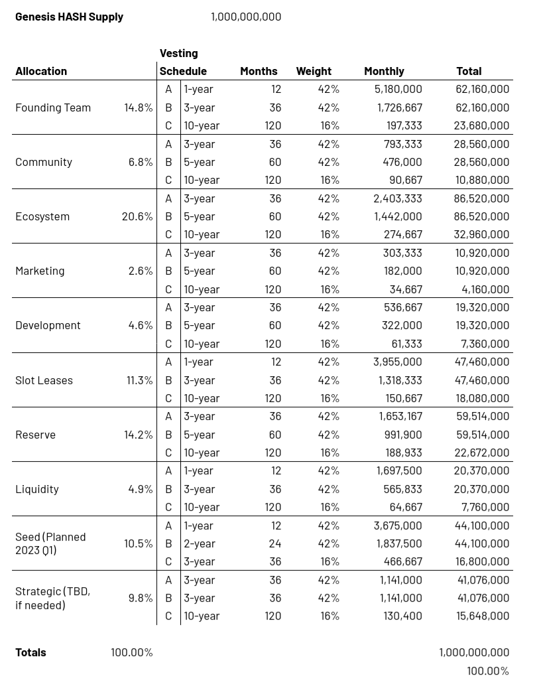

*The purpose of HASH is to proactively and automatically manage the health of the network through programmatic incentives.*

- Except for a flatter overall schedule for `Budgets`, each of the genesis allocations vest on 3 schedules
  - 42% of the allocation vests linearly in 1 year
  - 42% of the allocation vests linearly in 3 years
  - 16% of the allocation vests linearly in 10 years

- Crowdload rewards will vest linearly over the duration of corresponding parachain slot leases

:::caution

The most accurate information about tokenomics and governance is on-chain. 
:::
